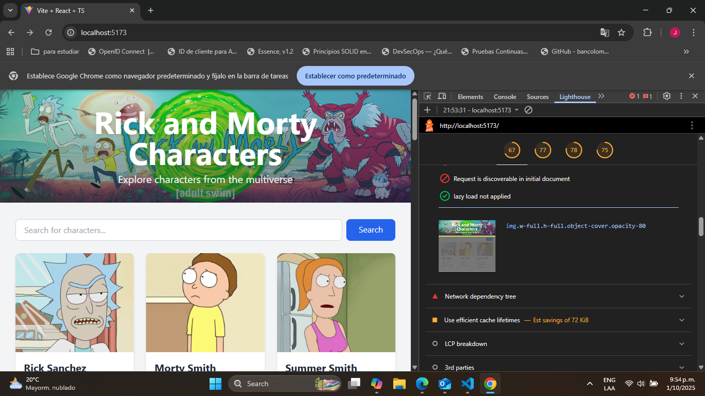

# React + TypeScript + Vite

This template provides a minimal setup to get React working in Vite with HMR and some ESLint rules.

Currently, two official plugins are available:

- [@vitejs/plugin-react](https://github.com/vitejs/vite-plugin-react/blob/main/packages/plugin-react) uses [Babel](https://babeljs.io/) for Fast Refresh
- [@vitejs/plugin-react-swc](https://github.com/vitejs/vite-plugin-react/blob/main/packages/plugin-react-swc) uses [SWC](https://swc.rs/) for Fast Refresh

## Expanding the ESLint configuration

If you are developing a production application, we recommend updating the configuration to enable type-aware lint rules:

```js
export default defineConfig([
  globalIgnores(['dist']),
  {
    files: ['**/*.{ts,tsx}'],
    extends: [
      // Other configs...

      // Remove tseslint.configs.recommended and replace with this
      tseslint.configs.recommendedTypeChecked,
      // Alternatively, use this for stricter rules
      tseslint.configs.strictTypeChecked,
      // Optionally, add this for stylistic rules
      tseslint.configs.stylisticTypeChecked,

      // Other configs...
    ],
    languageOptions: {
      parserOptions: {
        project: ['./tsconfig.node.json', './tsconfig.app.json'],
        tsconfigRootDir: import.meta.dirname,
      },
      // other options...
    },
  },
])
```

You can also install [eslint-plugin-react-x](https://github.com/Rel1cx/eslint-react/tree/main/packages/plugins/eslint-plugin-react-x) and [eslint-plugin-react-dom](https://github.com/Rel1cx/eslint-react/tree/main/packages/plugins/eslint-plugin-react-dom) for React-specific lint rules:

```js
// eslint.config.js
import reactX from 'eslint-plugin-react-x'
import reactDom from 'eslint-plugin-react-dom'

export default defineConfig([
  globalIgnores(['dist']),
  {
    files: ['**/*.{ts,tsx}'],
    extends: [
      // Other configs...
      // Enable lint rules for React
      reactX.configs['recommended-typescript'],
      // Enable lint rules for React DOM
      reactDom.configs.recommended,
    ],
    languageOptions: {
      parserOptions: {
        project: ['./tsconfig.node.json', './tsconfig.app.json'],
        tsconfigRootDir: import.meta.dirname,
      },
      // other options...
    },
  },
])
```

## Optimizaciones de Rendimiento de Imágenes

Se implementaron varias estrategias de optimización para mejorar el LCP (Largest Contentful Paint) y la experiencia de usuario general, enfocándose en las imágenes del encabezado y del pie de página.

### Imagen del Encabezado (Elemento LCP)

Para la imagen principal del encabezado, que es el elemento LCP más importante, se aplicaron las siguientes técnicas:

- **Preload**: Se añadió `<link rel="preload">` en el `index.html` para indicarle al navegador que comience a descargar esta imagen con alta prioridad lo antes posible, sin esperar a que se analice el resto del DOM.
- **Fetch Priority**: Se utilizó el atributo `fetchPriority="high"` en la etiqueta `` como una señal adicional para que el navegador priorice su descarga.
- **Async Decoding**: Se incluyó `decoding="async"` para permitir que el navegador decodifique la imagen fuera del hilo principal, reduciendo el bloqueo del renderizado.
- **Srcset y Sizes**: Aunque solo se dispone de una versión de la imagen, se añadieron los atributos `srcset` y `sizes` para informar al navegador sobre el tamaño real de la imagen y cómo se mostrará en el viewport. Esto le permite optimizar la asignación de recursos de manera más eficiente.

### Imagen del Pie de Página (Elemento Below-the-fold)

Para la imagen del pie de página, que no es visible al cargar la página, la estrategia fue diferente:

- **Lazy Loading**: Se implementó el atributo `loading="lazy"`, que le indica al navegador que difiera la descarga de esta imagen hasta que el usuario se desplace cerca de ella. Esto ahorra ancho de banda durante la carga inicial y acelera el renderizado del contenido visible.

### Resultados

A continuación se muestra una comparación del rendimiento antes y después de las optimizaciones.

**Antes:**





**Después:**


## Soporte Multi-idioma

El proyecto utiliza `i18next` y `react-i18next` para gestionar la internacionalización y ofrecer una experiencia multi-idioma.

### Configuración

La configuración principal se encuentra en `src/i18n.ts`. Los puntos clave son:

- **Backend HTTP**: Se usa `i18next-http-backend` para cargar los archivos de traducción de forma asíncrona desde el servidor.
- **Traducciones Precargadas**: Para optimizar la carga inicial, las traducciones en inglés (`en`) están directamente incrustadas en la configuración, evitando una solicitud de red para el idioma por defecto.
- **Estructura de Archivos**: Las traducciones se organizan en `public/locales/{idioma}/translation.json`.

### Uso

Para usar las traducciones dentro de un componente de React, se utiliza el hook `useTranslation`:

```jsx
import { useTranslation } from 'react-i18next';

const MyComponent = () => {
  const { t } = useTranslation();

  return <h1>{t('welcomeMessage')}</h1>;
};
```

## Pruebas Unitarias

Se realizó un esfuerzo para implementar y reparar el conjunto de pruebas unitarias del proyecto utilizando Jest y React Testing Library.

### Objetivo

El objetivo principal era añadir una prueba unitaria significativa para el servicio `rickAndMortyApi` en `src/services/rickAndMortyApi.ts`. La prueba debía verificar que, al llamar a una función del servicio (como `getCharacter`), se realizara una llamada HTTP correcta a través de `axios`, simulando una respuesta exitosa.

### Implementación y Resultados

Durante el proceso de implementación, se identificaron y solucionaron varios problemas críticos en el entorno de pruebas de Jest:

1.  **Inicialización de i18next**: Se corrigió la configuración de Jest para inicializar correctamente el sistema de traducciones (`i18next`) antes de ejecutar las pruebas. Esto solucionó la mayoría de los fallos en las pruebas de los componentes, que ahora pueden renderizar el texto correcto.
2.  **Importación de JSON**: Se ajustó la configuración de `ts-jest` para permitir la importación de archivos `.json`, lo cual era necesario para las traducciones.
3.  **Compatibilidad de Código Fuente**: Se modificó el código de `rickAndMortyApi.ts` para reemplazar el uso de `import.meta.env` (específico de Vite) por `process.env`, haciéndolo compatible con el entorno de Node.js de Jest.

Gracias a estos arreglos, la gran mayoría de las suites de pruebas del proyecto (incluyendo las de los componentes `CharacterCard`, `Pagination`, `SearchBar`, etc.) ahora **pasan exitosamente**.

### Dificultades y Estado Actual

El objetivo principal de crear una prueba funcional para `rickAndMortyApi.ts` no se pudo completar debido a un problema técnico complejo y persistente.

- **Problema de Hoisting en Jest**: Se encontró un `ReferenceError` recurrente al intentar simular el módulo `axios`. Este error se debe a un problema de *hoisting* (elevación de variables) en la forma en que Jest ejecuta los `jest.mock` en un proyecto configurado con `"type": "module"` (ES Modules).
- **Bloqueo Técnico**: A pesar de intentar múltiples patrones de configuración y simulación recomendados, este problema de fondo en la interacción entre Jest y la configuración del proyecto impidió que la prueba pudiera ejecutarse correctamente.

**Conclusión:** El entorno de pruebas es ahora mucho más estable y la mayoría de las pruebas funcionan. Sin embargo, la prueba específica para `rickAndMortyApi.ts` sigue bloqueada y requeriría cambios más profundos en las herramientas de desarrollo (como añadir `babel-jest`) para ser solucionada.-jest`) para ser solucionada.